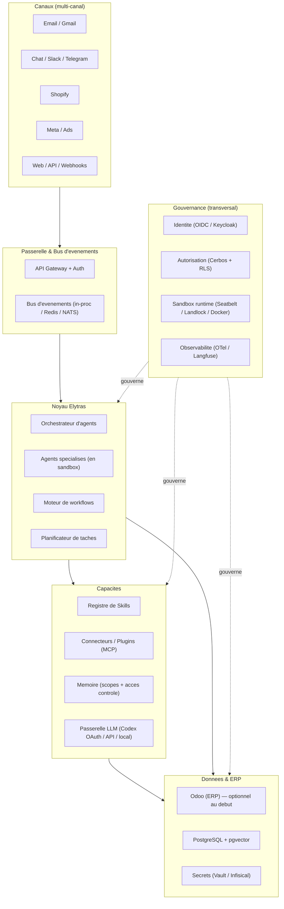
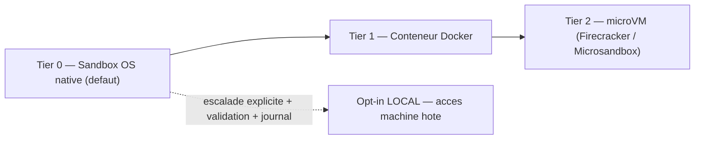
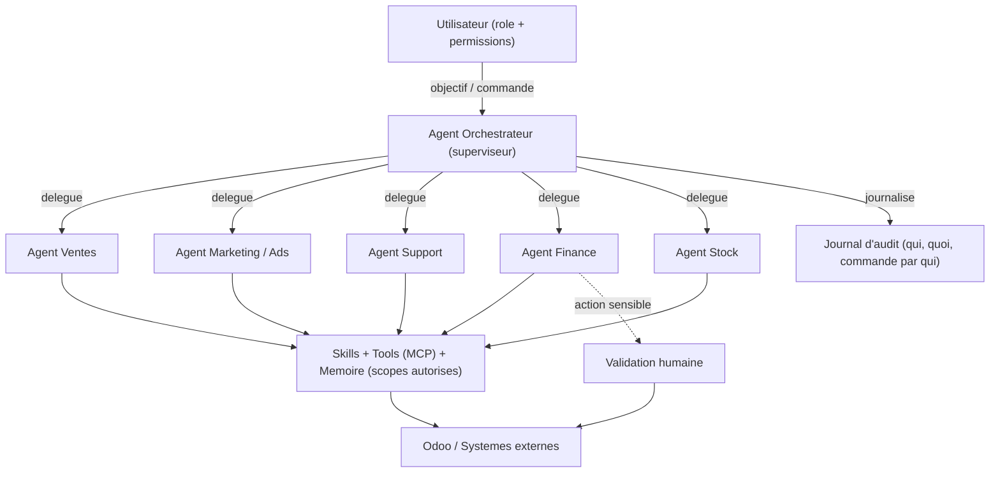
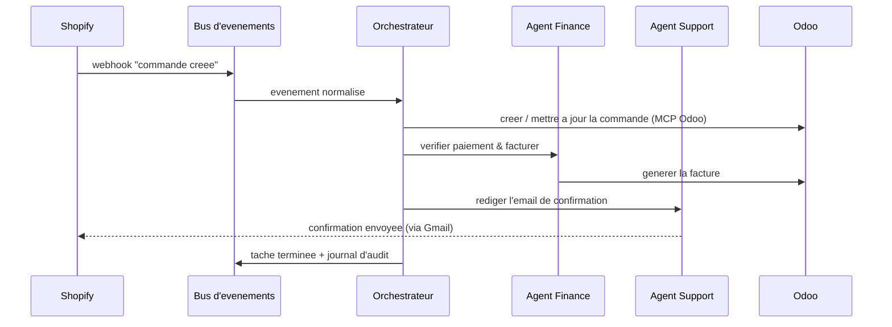
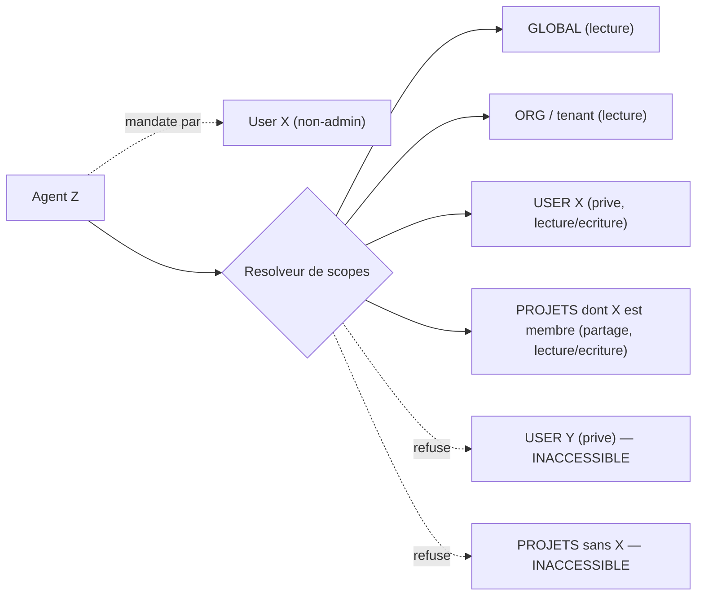
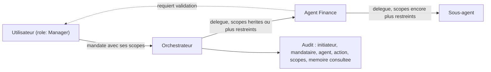
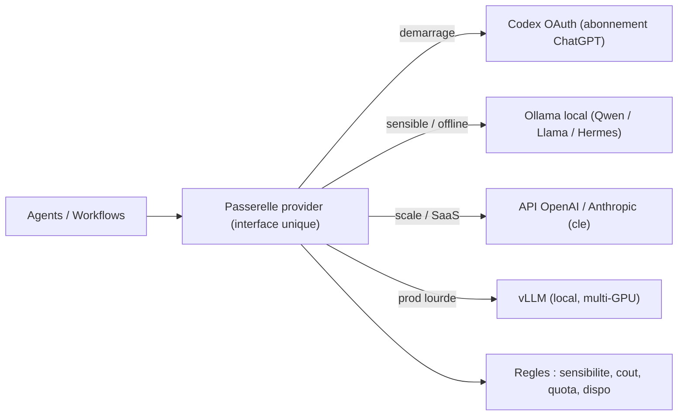

# Elytras — Vision & Architecture

> **Système de gestion d'entreprise piloté par un orchestre d'agents IA**
> Auto-hébergé · local-first · sandbox-first · multi-canal · multi-utilisateur · droits fins · mémoire à accès contrôlé · socle ERP Odoo · workflows façon Windmill · skills & plugins

| | |
|---|---|
| **Version** | v0.2 — *document de travail, à compléter* |
| **Date** | 30 mai 2026 |
| **Auteur** | Léo |
| **Statut** | Vision & architecture cible (avant décision d'implémentation) |
| **Portée** | PC unique / local-first d'abord → produit SaaS multi-tenant |
| **Inspiration** | Agents perso auto-hébergés type **Hermes Agent** (Nous Research) & **OpenClaw**, mais en version **entreprise** |

---

## Sommaire

1. [Résumé exécutif](#1-résumé-exécutif)
2. [Vision & principes directeurs](#2-vision--principes-directeurs)
3. [Positionnement : la version « entreprise » d'un agent perso](#3-positionnement--la-version-entreprise-dun-agent-perso)
4. [Concepts & vocabulaire](#4-concepts--vocabulaire)
5. [Cas d'usage](#5-cas-dusage)
6. [Architecture cible](#6-architecture-cible)
7. [Profil de déploiement : PC unique / local-first](#7-profil-de-déploiement--pc-unique--local-first)
8. [Modèle d'exécution : sandbox-first & opt-in local](#8-modèle-dexécution--sandbox-first--opt-in-local)
9. [Comment construire le socle](#9-comment-construire-le-socle)
10. [Orchestration d'agents](#10-orchestration-dagents)
11. [Skills, Tools & Connecteurs/Plugins (MCP)](#11-skills-tools--connecteursplugins-mcp)
12. [Moteur de workflows & pipelines](#12-moteur-de-workflows--pipelines)
13. [Système de mémoire hiérarchique à accès contrôlé](#13-système-de-mémoire-hiérarchique-à-accès-contrôlé)
14. [Multi-utilisateur, RBAC & multi-tenant](#14-multi-utilisateur-rbac--multi-tenant)
15. [Tâches : planification & visualisation](#15-tâches--planification--visualisation)
16. [Provider & passerelle LLM](#16-provider--passerelle-llm)
17. [Multi-canal](#17-multi-canal)
18. [Sécurité, gouvernance & observabilité](#18-sécurité-gouvernance--observabilité)
19. [Stack technique recommandé](#19-stack-technique-recommandé)
20. [Roadmap par phases](#20-roadmap-par-phases)
21. [Risques & questions ouvertes](#21-risques--questions-ouvertes)
22. [Prochaines étapes](#22-prochaines-étapes)
23. [Sources](#23-sources)

---

## 1. Résumé exécutif

**Elytras** est un **système d'exploitation d'entreprise** dans lequel le travail opérationnel est exécuté par un **orchestre d'agents IA** coordonnés, supervisés par des humains. Un utilisateur (ou un agent) formule un objectif ; un **agent orchestrateur** le décompose et le délègue à des **agents spécialisés** (ventes, marketing, support, finance, stock…), qui agissent sur les systèmes de l'entreprise via des **connecteurs** standardisés, en suivant des **skills** (savoir-faire packagés), en s'appuyant sur une **mémoire à accès contrôlé**, et en respectant des **droits fins**.

L'inspiration assumée, ce sont les **agents personnels auto-hébergés qui « grandissent avec toi »** (type **Hermes Agent** de Nous Research, ou **OpenClaw**) — mais portés au niveau **entreprise** : multi-utilisateur, multi-agents orchestrés, mémoire cloisonnée par utilisateur/projet, gouvernance et audit.

Cinq partis pris structurent le projet :

- **Local-first, sur un PC.** Ça doit tourner tranquillement sur une machine normale. La grosse architecture « scale » reste une cible, pas un prérequis.
- **Sandbox-first.** Tout s'exécute par défaut dans une sandbox isolée ; agir directement sur la machine (« local ») est une escalade explicite, validée et journalisée.
- **Provider Codex OAuth pour démarrer.** On commence avec l'abonnement ChatGPT via Codex (coût quasi nul), derrière une **couche provider abstraite** qui rend le modèle interchangeable (API OpenAI/Anthropic, ou modèles locaux Ollama).
- **Mémoire hiérarchique cloisonnée.** Mémoire globale / organisation / projet (partagée) / utilisateur (privée) / agent / session, avec un contrôle d'accès strict : un agent mandaté par l'utilisateur X ne voit jamais la mémoire privée de Y, sauf projet commun → mémoire partagée.
- **Orchestration, pas un simple chatbot.** Plusieurs agents collaborent et se commandent ; chaque action est traçable (« quel agent a fait quoi, commandé par qui »).

**Recommandation d'approche** (détaillée §9) : **assembler des briques open-source matures, en mode léger sur un PC**, reliées par un **noyau Elytras** mince (orchestration, registre skills/plugins, RBAC, mémoire, console), avec deux profils de déploiement : **PC unique / local-first** (démarrage) et **scale / multi-tenant** (plus tard).

---

## 2. Vision & principes directeurs

**Objectif.** Faire tourner une entreprise — d'abord la tienne, ensuite celle des clients — avec un effectif d'agents IA qui exécutent les tâches répétitives et coordonnent les tâches complexes, sous contrôle humain, avec une traçabilité totale, sur une infrastructure que tu héberges.

**Principes directeurs :**

1. **Humain aux commandes.** Les agents proposent et exécutent, mais les actions irréversibles ou sensibles (paiement, envoi de masse, suppression, engagement juridique) passent par une validation humaine.
2. **Local-first.** Démarrer et fonctionner sur un PC unique ; le cloud/cluster est une option de montée en charge, pas une dépendance.
3. **Sandbox-first.** Isolation par défaut ; l'accès à la machine hôte est une exception explicite et tracée.
4. **Tout est traçable.** Chaque tâche enregistre son initiateur (humain ou agent parent), l'agent exécutant, la commande, les outils utilisés, le résultat.
5. **Mémoire cloisonnée.** La mémoire est un actif sensible : elle est scoping-par-défaut, jamais partagée implicitement entre utilisateurs.
6. **Moindre privilège.** Un agent n'a accès qu'aux outils, données et mémoires strictement nécessaires à son rôle, dans le périmètre où il opère.
7. **Modulaire & extensible.** Ajouter un canal, un connecteur, un agent, une skill ou un provider ne doit pas toucher au cœur. Tout est plugin.
8. **Standards ouverts d'abord.** MCP (connecteurs), format Agent Skills (savoir-faire), OpenTelemetry (observabilité), OAuth/OIDC (identité), pgvector (mémoire) — pour éviter le lock-in.
9. **Provider-agnostique.** Le modèle LLM est une dépendance remplaçable derrière une passerelle.

**Ce qu'Elytras n'est pas :** un nouveau LLM, un clone d'Odoo, ni un simple « n8n + ChatGPT ». C'est la **couche d'orchestration, de mémoire, de gouvernance et d'extension** qui transforme un agent perso en une entreprise opérée par des agents.

---

## 3. Positionnement : la version « entreprise » d'un agent perso

Tu pars d'une intuition juste : les meilleurs agents auto-hébergés de 2025-2026 sont des **assistants personnels qui apprennent et grandissent** — ils écrivent leurs propres skills, gardent une mémoire persistante, sont multi-canal et agnostiques au modèle.

| Référence | Ce qu'elle apporte | Ce qui manque pour l'entreprise |
|---|---|---|
| **Hermes Agent** (Nous Research, MIT) | Agent auto-améliorant : crée des skills à partir de l'expérience, mémoire multi-niveaux persistante, multi-canal (Telegram/Slack/Discord/…), model-agnostic, tourne d'un PC à un VPS. | Mono-utilisateur ; pas de RBAC, pas d'orchestre multi-agents gouverné, pas de mémoire cloisonnée par utilisateur/projet, pas d'audit. |
| **OpenClaw + Lossless Claw** | Agent CLI open-source + gestion de contexte **sans perte** (DAG de résumés hiérarchiques, rien n'est jamais oublié dans une session). | Mémoire **mono-session / mono-agent**, base SQLite monolithique, aucun contrôle d'accès, pas de scope utilisateur/projet. |

**La thèse d'Elytras :** garder la philosophie (auto-amélioration, skills, mémoire riche, multi-canal, model-agnostic, sandbox) et ajouter la **couche entreprise** qui manque : **multi-utilisateur + RBAC**, **orchestre multi-agents**, **mémoire à accès contrôlé**, **gouvernance/audit**, **connecteurs-plugins (MCP)**, **workflows**.

> Option pragmatique : **réutiliser Hermes Agent comme *runtime par agent*** (un agent Elytras = une instance Hermes paramétrée), et bâtir Elytras comme la couche d'orchestration et de gouvernance au-dessus. À évaluer en POC (§22).

---

## 4. Concepts & vocabulaire

| Terme | Définition dans Elytras |
|---|---|
| **Agent** | Entité autonome (LLM + instructions + mémoire) qui poursuit un objectif en appelant des tools et en suivant des skills, dans la limite de ses permissions, à l'intérieur d'une sandbox. |
| **Orchestrateur / Superviseur** | Agent (ou routeur déterministe) qui reçoit un objectif, le décompose, le délègue à des agents spécialisés, agrège les résultats. |
| **Tool** | Fonction unique appelable (lire un fichier, créer une commande Odoo, envoyer un email). Une entrée, une sortie. |
| **Connecteur / Plugin** | Accès standardisé à un système externe (Odoo, Shopify, Gmail, Meta…). Implémenté comme **serveur MCP**. *« Avec quoi l'agent agit. »* |
| **Skill** | Savoir-faire packagé : procédure multi-étapes décrivant **comment** accomplir une tâche. Format `SKILL.md`. *« Comment l'agent procède. »* |
| **Workflow / Pipeline** | Enchaînement orchestré d'étapes (code, tools, étapes-agent, validations), déclenché par un événement, un cron ou une commande. |
| **Tâche (Task)** | Unité de travail traçable, planifiable, assignée à un agent ou un humain, avec statut, initiateur, dépendances. |
| **Mémoire (scope)** | Connaissance persistée, rattachée à un périmètre : **global / organisation / projet / utilisateur / agent / session**. |
| **Sandbox** | Environnement d'exécution isolé (système de fichiers + réseau) dans lequel un agent agit par défaut. |
| **Opt-in local** | Escalade explicite et journalisée permettant à un agent d'agir hors sandbox, sur la machine hôte. |
| **Provider** | Backend LLM (Codex OAuth, API OpenAI/Anthropic, Ollama local…), interchangeable derrière la passerelle. |
| **Canal** | Point d'entrée/sortie de l'entreprise (email, chat, webhook Shopify, formulaire web, plateforme pub…). |
| **Rôle & Permission** | Ce qu'un utilisateur **ou un agent** a le droit de faire, sur quelles ressources, dans quel tenant. |
| **Tenant** | Périmètre d'isolation (une entreprise cliente). En local = un tenant ; en SaaS = N tenants isolés. |

**Distinction clé :** **Connecteur (MCP) = accès** · **Skill = méthode** · **Tool = action atomique** · **Mémoire = ce dont l'agent se souvient, cloisonné par scope**.

---

## 5. Cas d'usage

### 5.1 Local / interne — Vanille Désire (e-commerce)

- **Triage & réponse support.** Agent Support lit les emails (Gmail), classe, rédige une réponse à valider, met à jour la commande dans Odoo.
- **Opérations commandes.** À chaque commande Shopify : synchro Odoo, contrôle stock, facturation, email de confirmation, signalement d'anomalies.
- **Reporting marketing.** Agent Ads agrège les performances Meta (ROAS/CAC) et propose des arbitrages de budget (sans jamais les exécuter sans validation).
- **Réassort & achats.** Agent Stock surveille Odoo, prévoit les ruptures, prépare des demandes d'achat à valider.
- **Briefing quotidien.** Chaque matin, un workflow compile ventes, support, pub, stock en un résumé envoyé à Léo.

### 5.2 Produit — SaaS multi-tenant

Mêmes capacités, exposées à des entreprises clientes : tenant isolé (données, agents, **mémoires**, connecteurs, budgets LLM), catalogue de plugins/skills installables, console de supervision. La conception **anticipe le multi-tenant** dès le départ, même si le premier déploiement est mono-tenant sur un PC.

---

## 6. Architecture cible

### 6.1 Vue d'ensemble en couches



### 6.2 Rôle de chaque couche

| Couche | Rôle | Brique (profil PC unique) |
|---|---|---|
| **Canaux** | Recevoir/émettre sur tous les points de contact. | Connecteurs MCP par canal |
| **Passerelle & Bus** | Normaliser en événements, router, découpler. | API + bus léger (in-proc ou Redis) |
| **Noyau** | Décider quel agent fait quoi ; workflows ; planification. | Orchestrateur (LangGraph core ou Hermes) + cron/Windmill |
| **Capacités** | Doter les agents de savoir-faire, d'accès, de mémoire et de modèles. | Skills + MCP + **Mémoire pgvector** + passerelle LLM |
| **Données & ERP** | État métier + mémoire + secrets. | PostgreSQL + pgvector (+ Odoo en Docker au besoin) |
| **Gouvernance** | Qui est qui, qui peut quoi, où ça s'exécute, que s'est-il passé. | Auth + Cerbos/RLS + **sandbox OS** + logs |

Le **noyau Elytras** est la seule partie réellement spécifique : orchestration, registre skills/plugins, RBAC, **mémoire à accès contrôlé**, console.

---

## 7. Profil de déploiement : PC unique / local-first

Pour « tourner tranquillement sur un PC », on distingue deux profils. On **démarre en Profil A** ; chaque brique peut migrer vers le Profil B sans refonte (mêmes interfaces).

| Composant | **Profil A — PC unique (démarrage)** | **Profil B — Scale / multi-tenant** |
|---|---|---|
| **Provider LLM** | **Codex OAuth** (abonnement ChatGPT) + **Ollama** local en repli | + API OpenAI/Anthropic à la clé, **vLLM** multi-GPU |
| **Orchestration** | LangGraph core (ou Hermes Agent) en process | + durabilité Temporal pour sagas critiques |
| **Workflows** | cron + scripts ; Windmill optionnel | Windmill (ou Kestra) complet |
| **Mémoire** | **PostgreSQL + pgvector** (ou SQLite + sqlite-vec ultraléger) | pgvector partitionné + graphe temporel (Zep) optionnel |
| **Exécution** | **sandbox OS native** (Seatbelt/Landlock) | + Docker / microVM par agent |
| **Identité** | utilisateurs locaux simples | **Keycloak** (OIDC/SSO/MFA) |
| **Autorisation** | module RBAC léger + RLS Postgres | **Cerbos** + RLS |
| **Bus d'événements** | in-process ou Redis | NATS |
| **ERP** | Odoo CE en Docker **si besoin** (sinon différé) | 1 base Odoo par tenant |
| **Observabilité** | logs structurés + SQLite | OTel + Langfuse + Grafana |
| **Déploiement** | `docker-compose` (quelques conteneurs) | Kubernetes |

**Empreinte cible Profil A :** quelques conteneurs (Postgres, le noyau, 1-2 connecteurs MCP, Ollama si modèle local) + le provider Codex via OAuth. Odoo, Keycloak, Windmill, NATS, Langfuse, vLLM ne sont **pas** requis au démarrage — ils s'ajoutent quand le besoin (et la machine) le justifient.

---

## 8. Modèle d'exécution : sandbox-first & opt-in local

Ton instinct (« tout en sandbox, avec option d'agir en local pour éviter les problèmes ») est exactement la bonne pratique 2026 — c'est ce que font déjà Codex et Claude Code nativement. On le formalise en **niveaux d'isolation**, du plus léger au plus fort, avec une **escalade explicite** pour sortir de la sandbox.



| Niveau | Isolation | Coût/poids | OS | Quand |
|---|---|---|---|---|
| **Tier 0 — sandbox OS native** | FS + réseau (kernel) | quasi nul | mac (Seatbelt) / Linux (Landlock+seccomp) | **par défaut**, toutes les actions d'agent |
| **Tier 1 — Docker** | process, kernel partagé | faible | mac / Linux | outils tiers, agents custom plus lourds |
| **Tier 2 — microVM** | hardware, kernel dédié | modéré (Linux/KVM) | Linux | isolation forte (code non fiable) |
| **Opt-in local** | aucune (hôte) | — | mac / Linux | escalade explicite, validée, **journalisée** |

**Principes d'exécution :**

- **Défaut = Tier 0.** Zéro infra, tourne sur un PC ; réseau via proxy avec liste blanche de domaines ; écritures limitées au workspace.
- **Réutiliser l'existant.** Le runtime de sandbox open-sourcé par Anthropic (`sandbox-runtime`) et le sandboxing natif de Codex (Landlock/Seatbelt) sont directement réemployables — pas besoin de réinventer.
- **Opt-in local = escalade gouvernée.** Sortir de la sandbox exige une permission RBAC + (selon la sensibilité) une validation humaine, et **est toujours journalisé**. C'est l'application du human-in-the-loop au niveau exécution.
- **Cohérence avec la mémoire et les droits :** la sandbox d'un agent ne monte que les **scopes mémoire** et les **connecteurs** autorisés pour le couple (agent, utilisateur mandant).

---

## 9. Comment construire le socle

Trois philosophies — comparaison et recommandation.

| Approche | Description | Avantages | Inconvénients |
|---|---|---|---|
| **A. Tout custom** | Coder orchestration, workflow, RBAC, mémoire, connecteurs from scratch. | Contrôle total. | Très long, réinvente des standards, dette énorme. |
| **B. Tout sur un seul outil** | Pousser un seul produit (tout Windmill, tout Odoo, tout Hermes). | Simple à démarrer. | Plafond de verre : aucun outil ne couvre seul orchestration + ERP + RBAC + mémoire cloisonnée + LLM hybride. |
| **C. Assembler + noyau mince** ✅ | Briques open-source best-of-breed reliées par un noyau Elytras (orchestration, skills/plugins, RBAC, mémoire, console), **en mode léger sur un PC**. | Rapide, écosystèmes matures, on ne maintient que la valeur ajoutée. | Intégration de plusieurs systèmes ; vigilance licences. |

**Recommandation : approche C, démarrée en Profil A (PC unique).** On n'écrit du code que pour le noyau (le différenciateur) et on branche des briques éprouvées, qu'on n'active que lorsqu'elles sont nécessaires.

**Points de vigilance licences :**

- **LangGraph** : n'utiliser que le **core (MIT)** ; éviter le serveur (`langgraph-api`, licence Elastic) pour l'auto-hébergement.
- **Windmill** : **AGPLv3** — libre en self-host tant qu'on ne réexpose pas Windmill *tel quel* en SaaS. **À trancher avant la phase SaaS** (ou préférer **Kestra**, Apache 2.0).
- **Hermes Agent** : **MIT** — réutilisable librement comme runtime par agent.
- **Codex OAuth** : usage **perso/interne** OK ; **flou ToS pour un produit distribué** → prévoir l'abstraction provider (§16).
- **Odoo** : **Community LGPLv3** (self-host libre) ; **Enterprise** payant pour compta complète, IA native, Studio.

---

## 10. Orchestration d'agents

### 10.1 Le modèle « orchestre »



- **Superviseur → spécialistes** : décompose, délègue à des agents au périmètre clair, agrège.
- **Délégation inter-agents** : un agent peut en commander un autre ; la **chaîne d'autorité** est enregistrée (§14.3).
- **Garde-fous** : toute action sensible déclenche une validation humaine.
- **Traçabilité native** : chaque délégation et chaque appel d'outil sont journalisés → matière première de la visualisation des workflows.

### 10.2 Choix de framework

| Brique | Rôle | Verdict |
|---|---|---|
| **LangGraph (core, MIT)** | Logique d'agent : graphe d'états, superviseur, human-in-the-loop, MCP. | ✅ **Socle d'orchestration** (core uniquement). |
| **Hermes Agent (MIT)** | Runtime d'agent auto-améliorant, mémoire, multi-canal. | ➕ **Candidat runtime par agent** (à évaluer en POC). |
| **Temporal (MIT)** | Durabilité forte des workflows longs. | ➕ **Optionnel** (Profil B), sagas critiques. |
| **CrewAI / AG2 / OpenAI Agents SDK** | Alternatives (rôles, conversation, handoffs). | Plans B. |

**Décision :** **LangGraph (core)** pour la délégation et le raisonnement ; exécutions **en sandbox** et **enveloppées dans des workflows** (cron simple au début, Windmill ensuite). Évaluer **Hermes Agent** comme runtime par agent. **Temporal** seulement si durabilité transactionnelle multi-jours requise.

### 10.3 État de l'agent

- **Contexte de tâche** : état du graphe LangGraph (checkpoint Postgres) + **contexte de session sans perte** (couche lossless, §13.4).
- **Mémoire longue** : voir §13 (scopée + recherche sémantique pgvector).
- **État métier** : la vérité opérationnelle vit dans **Odoo** / la base, pas dans la tête de l'agent.

---

## 11. Skills, Tools & Connecteurs/Plugins (MCP)

### 11.1 MCP comme standard de connecteurs

Le **Model Context Protocol (MCP)** (standard ouvert initié par Anthropic fin 2024, largement adopté depuis) est la **fondation du système de plugins/connecteurs**. Chaque intégration (Odoo, Shopify, Gmail, Meta, Slack…) est un **serveur MCP** exposant des *tools*. « Installer un plugin » = « enregistrer un serveur MCP + ses permissions + ses skills ».

**Sécurité MCP (dès le début) :** passerelle centralisant l'auth (**OAuth 2.1 + PKCE**), validation des *scopes* par outil, journalisation ; protection contre le *tool poisoning* (provenance/signature des serveurs tiers) ; scopes fins par JWT (`mcp:odoo:sales:read`, `mcp:shopify:orders:write`… + claims `tenantId`/`agentId`).

### 11.2 Skills importables (format Agent Skills)

Une **skill** = un dossier versionné avec un `SKILL.md` (frontmatter `name` + `description`, puis instructions), éventuellement `scripts/`, `references/`, `assets/`. C'est la façon de **packager le savoir-faire métier** et de l'importer/partager (archive `.skill`).

- **Auto-amélioration (inspiration Hermes) :** un agent peut **écrire/raffiner ses propres skills** après une tâche réussie — sous validation, et versionné.
- **Registre par tenant** : skills globaux de la plateforme + skills privés du tenant.

### 11.3 « Marketplace » de plugins

Installer un plugin = enregistrer un **bundle** `{ serveur(s) MCP + skills + permissions requises + config }`. Catalogue interne (puis public en SaaS), avec demande explicite des scopes (comme une appli mobile demande ses permissions).

---

## 12. Moteur de workflows & pipelines

### 12.1 Choix : Windmill (quand on en a besoin)

En Profil A, un simple **cron + scripts** suffit. Quand le besoin de workflows visuels/planifiés arrive, **Windmill** est le mieux positionné : builder visuel **+** scripts multi-langages, déclencheurs riches (webhook, cron, Postgres CDC, Kafka, NATS, email…), app builder, fonctions IA natives, **AGPLv3**.

| Besoin | Windmill | n8n | Temporal | Kestra |
|---|---|---|---|---|
| Builder visuel | ✅ | ✅ | ❌ | ✅ |
| Code multi-langage réel | ✅ | ⚠️ | ✅ | ✅ |
| Déclencheurs/scheduling riches | ✅ | ✅ | ⚠️ | ✅ |
| Étapes IA / agent | ✅ | ⚠️ | ❌ | ✅ |
| Durabilité forte (jours) | ⚠️ | ❌ | ✅ | ⚠️ |
| Licence self-host | AGPLv3 | Sustainable Use | MIT | Apache 2.0 |

**Décision :** **Windmill** comme moteur de workflows/scheduling (Profil B), **Kestra** en alternative si l'AGPL gêne le SaaS, **Temporal** en complément ciblé pour la durabilité critique.

### 12.2 Exemple de pipeline



---

## 13. Système de mémoire hiérarchique à accès contrôlé

C'est un pilier d'Elytras. **Lossless Claw** que tu as aimé est excellent pour **ne jamais oublier dans une session** — mais c'est une mémoire **mono-session, mono-agent, sans contrôle d'accès**. On fait mieux en la traitant comme **une seule couche** d'un système à plusieurs niveaux, cloisonné par scope.

### 13.1 Les scopes de mémoire

| Scope | Contenu | Lecture | Écriture |
|---|---|---|---|
| **Global** | connaissances plateforme (procédures, politiques) | tous agents authentifiés | admins plateforme |
| **Organisation / tenant** | contexte de l'entreprise | agents du tenant | rôles autorisés du tenant |
| **Projet (partagé)** | tout ce qui concerne un projet commun | agents des membres du projet | agents des membres du projet |
| **Utilisateur (privé)** | préférences, historique propres à X | agents **mandatés par X** | agents mandatés par X |
| **Agent** | spécialisation/réglages d'une instance d'agent | l'agent | l'agent (sous validation) |
| **Session / run** | contexte éphémère d'une conversation | l'agent courant | l'agent courant |

### 13.2 Règle d'accès (ton scénario exact)



À chaque accès mémoire, l'agent fournit **son `agent_id` + le `user_id` du mandant**. Le résolveur calcule l'ensemble lisible = `global ∪ org ∪ user_X ∪ projets(où X est membre) ∪ agent ∪ session`. **Aucun chemin de code** ne permet d'atteindre `user_Y` si `X ≠ Y` et sans projet commun. Si **X et Y partagent le projet P**, alors `projet_P (partagé)` est dans l'ensemble des deux → **mémoire partagée**, exactement ce que tu décris.

### 13.3 Stockage (léger, PC unique)

- **PostgreSQL + pgvector** comme colonne vertébrale (recherche sémantique), ou **SQLite + sqlite-vec** en ultraléger pour démarrer.
- Chaque entrée porte des métadonnées : `{ scope_type, owner_id, project_id, agent_id, visibility, type, created_at, expires_at, tenant_id }`.
- **PostgreSQL Row-Level Security (RLS)** applique l'isolation **au niveau base** (défense en profondeur : même un bug applicatif ne peut pas fuiter une mémoire d'un autre user).
- **Embeddings locaux** (ex. `nomic-embed` via Ollama, ou sentence-transformers) → **aucun appel externe** pour la mémoire sensible.

### 13.4 Les couches de mémoire

1. **Session sans perte (lossless)** — inspiration **Lossless Claw** : tout est persité, l'historique ancien est résumé en **DAG hiérarchique**, le contexte actif = résumés + N derniers messages. Rien n'est oublié *dans une session*.
2. **Long terme scopée** — faits/préférences/résumés rangés par scope dans pgvector + RLS, récupérés par recherche sémantique filtrée par scopes autorisés.
3. **Déclarative structurée** — fichiers type **`MEMORY.md` + frontmatter YAML** (scope, owner, project_id, visibility, type) pour la connaissance curée (profils, décisions, préférences), indexés dans pgvector.
4. **Graphe temporel (optionnel, Profil B)** — type **Zep/Graphiti** quand les agents doivent raisonner sur l'évolution des faits (un fait A supplanté par B à une date) — utile en CRM/RH/finance.

**Promotion :** à la clôture d'une session, les résumés distillés **remontent** vers le scope `utilisateur` (ou `projet` si pertinent), pour devenir de la mémoire long terme.

```yaml
# Exemple d'entree MEMORY.md
---
scope: project          # global | org | project | user | agent | session
owner: user_leo
project_id: vanille-desire
visibility: shared      # private | shared
type: decision          # preference | decision | fact | summary
created: 2026-05-30
---
Décision : les remboursements > 50€ exigent une validation humaine.
```

### 13.5 Moteur : faire ou réutiliser

| Option | Pour | Contre |
|---|---|---|
| **Couche maison sur pgvector + RLS** ✅ | Colle exactement à ton modèle de scopes ; ultraléger ; contrôle total. | À écrire (mais simple). |
| **Mem0** (Apache 2.0) | Scopes `user/agent/app/run` prêts, pgvector, API REST. | Une dépendance de plus ; le partage projet à adapter. |
| **Letta** (Apache 2.0) | Runtime agent complet + *shared memory blocks* (mémoire d'équipe/projet). | Plus lourd ; remplace l'infra d'exécution. |

**Recommandation :** démarrer avec une **couche mémoire maison mince sur pgvector + RLS** (elle épouse ton modèle d'accès au plus près, et reste légère), en empruntant la **taxonomie de scopes de Mem0** et la **compaction lossless** de Lossless Claw. Garder **Mem0/Letta** comme accélérateurs si on veut du « batteries included ».

---

## 14. Multi-utilisateur, RBAC & multi-tenant

### 14.1 Modèle de droits

**RBAC + ABAC**, avec **autorisation à l'exécution** (l'agent demande, à chaque appel, s'il a le droit ici et maintenant) :

- **Sujets** : utilisateurs **et** agents (un agent est un principal de sécurité).
- **Ressources** : agents, skills, connecteurs/tools, workflows, **mémoires (par scope)**, données Odoo, modèles LLM, **droit de sortir de la sandbox**.
- **Permissions** : `lire` / `exécuter` / `modifier` / `valider`, scopées par ressource et par tenant.

**Moteur :** **Cerbos** (open-source, RBAC+ABAC, runtime, intégration MCP) en Profil B ; module léger en Profil A. **PostgreSQL RLS** pour l'isolation des données et **des mémoires**.

### 14.2 Identité

**Keycloak** (OIDC/OAuth 2.1, SSO, MFA) pour les humains (Profil B ; simple en A). Les agents reçoivent des identités de service avec **JWT à scopes fins** (et rotation).

### 14.3 Chaîne d'autorité (humain → agent → sous-agent)

Règle : **un agent n'exerce jamais plus de droits que le principal qui l'a mandaté** (délégation atténuante, jamais amplifiante) — droits **et** scopes mémoire inclus.



### 14.4 Isolation multi-tenant (interne → SaaS)

| Dimension | Local (1 tenant) | SaaS (N tenants) |
|---|---|---|
| **Données applicatives** | 1 base | **RLS PostgreSQL** (filtre `tenant_id`) |
| **Mémoire** | scopes | scopes **+ `tenant_id` + RLS** |
| **Odoo** | 1 base | **1 base Odoo par tenant** |
| **Outils / connecteurs** | tous | scopes MCP par tenant |
| **Skills** | registre unique | registre par tenant |
| **LLM** | budget global | budgets & routage par tenant |
| **Logs/traces** | partagés | séparés par tenant |

Concevoir dès maintenant les tables avec `tenant_id` + RLS, même en mono-tenant.

---

## 15. Tâches : planification & visualisation

- **Magasin de tâches** : table dédiée (statut, initiateur, agent, dépendances, échéance, tenant) ; les projets clients peuvent s'appuyer sur le module **Projet d'Odoo**.
- **Planification** : cron simple (Profil A) → déclencheurs/crons **Windmill** (Profil B) ; tâches ponctuelles ou récurrentes ; files par priorité/tenant.
- **Visualisation (console Elytras)** : **Kanban**, **graphe de workflow** (qui a délégué à qui — issu de l'audit), **Gantt/timeline**, **vue agent** (charge, actions en attente de validation).

La console est une **app web custom** (le seul gros morceau d'UI) ; au début, certaines vues peuvent réutiliser l'**app builder de Windmill**.

---

## 16. Provider & passerelle LLM

### 16.1 Démarrage : Codex OAuth

On démarre avec **Codex via OAuth (« Sign in with ChatGPT »)** : ça utilise ton **abonnement ChatGPT** (coût marginal quasi nul) et tourne en local. C'est un excellent point de départ pour un PC unique.

**Réserves à connaître :**

- **Quotas** : l'usage est plafonné par fenêtres (~5 h) et quota hebdo, **partagés** avec ton usage Codex normal — à surveiller pour un système d'agents intensif.
- **Flou ToS** : OpenAI tolère l'usage de *ton* abonnement « là où tu veux », mais **n'a pas validé explicitement** l'OAuth d'abonnement comme backend d'un **produit tiers distribué**. → **Parfait pour le perso/interne**, à **ne pas embarquer tel quel dans le SaaS**.

### 16.2 Abstraction provider (dès le jour 1)



- **Interface unique** (type **LiteLLM** ou couche maison compatible OpenAI) : Codex OAuth ↔ API ↔ Ollama ↔ vLLM **interchangeables sans toucher aux agents**.
- **Repli local** : **Ollama** avec un modèle léger (familles Qwen/Llama/**Hermes** orientées agent/function-calling) pour le **sandbox**, le **sensible** et le **hors-ligne**.
- **Routage** (Profil B) : sensibilité/PII → local ; tâches complexes → API ; fallback automatique sur quota/indispo ; budgets par tenant.

C'est cohérent avec ton choix « mix » : on commence économique (Codex OAuth + Ollama), on garde la porte ouverte aux API et au local lourd, **sans dette**.

---

## 17. Multi-canal

Chaque canal est un connecteur (MCP) qui **normalise** entrées/sorties en événements, pour que les agents soient agnostiques au canal.

| Canal | Entrée | Sortie |
|---|---|---|
| **Email (Gmail)** | nouveaux messages, threads | réponses, drafts |
| **Shopify** | webhooks commandes/clients/stock | maj produits, remboursements (à valider) |
| **Meta / Ads** | métriques, événements | rapports, recommandations budget (à valider) |
| **Chat (Slack/Telegram)** | messages, commandes | notifications, demandes de validation |
| **Web / API** | formulaires, webhooks tiers | réponses, callbacks |

Un même objectif peut arriver par email, chat ou webhook et suivre le même traitement.

---

## 18. Sécurité, gouvernance & observabilité

- **Human-in-the-loop** obligatoire sur les actions irréversibles/sensibles. **Règle ferme : aucun mouvement d'argent, paiement, virement ou ordre ne s'exécute sans action humaine explicite.**
- **Sandbox-first** (§8) : isolation par défaut ; **opt-in local gouverné** (permission + validation + journal).
- **Isolation mémoire** (§13) : scopes + RLS ; pas de fuite inter-utilisateurs.
- **Secrets** : **Vault** / Infisical ; jamais de secret en clair dans configs/skills ; clés API à rotation.
- **Audit log immuable** : initiateur, mandataire, agent, commande, scopes, outils, **mémoires consultées**, résultat, tenant.
- **Garde-fous agents** : limites d'action (montant max, volume d'emails/h), liste blanche d'outils par rôle, *kill switch* par agent/tenant.
- **Observabilité** : **OpenTelemetry** (traces), **Langfuse** (LLM : prompts, coûts, latences), **Grafana/Prometheus** (infra) — en Profil B ; logs structurés en A.
- **Conformité** : RGPD, résidence des données — argument fort pour le **local/embeddings locaux** sur le sensible.

---

## 19. Stack technique recommandé

| Domaine | Profil A (PC unique) | Profil B (scale) | Licence |
|---|---|---|---|
| **Provider LLM** | **Codex OAuth** + **Ollama** | + API OpenAI/Anthropic, **vLLM** | — / Apache 2.0 |
| **Passerelle provider** | LiteLLM ou couche maison | idem | open-source |
| **Orchestration** | **LangGraph core** (ou Hermes) | + **Temporal** | MIT |
| **Exécution / sandbox** | **Seatbelt/Landlock** (natif) | + Docker / microVM | open-source |
| **Workflows** | cron + scripts | **Windmill** (ou Kestra) | AGPLv3 / Apache 2.0 |
| **Connecteurs/plugins** | **MCP** (+ passerelle) | idem + scopes/OAuth | ouvert |
| **Skills** | **format Agent Skills** | idem + registre/tenant | ouvert |
| **Mémoire** | **pgvector + RLS** (couche maison) + embeddings locaux | + graphe temporel (Zep) | PostgreSQL / Apache 2.0 |
| **Identité** | utilisateurs locaux | **Keycloak** | Apache 2.0 |
| **Autorisation** | module léger + RLS | **Cerbos** + RLS | Apache 2.0 |
| **Bus d'événements** | in-proc / Redis | **NATS** | BSD / Apache 2.0 |
| **Base de données** | **PostgreSQL + pgvector** | idem (partitionné) | PostgreSQL |
| **ERP** | Odoo CE (Docker, si besoin) | 1 Odoo / tenant | LGPLv3 |
| **Secrets** | `.env` chiffré / Infisical | **Vault** | open-source |
| **Observabilité** | logs structurés | **OTel + Langfuse + Grafana** | open-source |
| **Console** | **Next.js** (custom) | idem | — |
| **Déploiement** | **docker-compose** | **Kubernetes** | — |

---

## 20. Roadmap par phases

### Phase 0 — Fondations local-first *(PC unique)*
`docker-compose` minimal : PostgreSQL + pgvector, passerelle provider (**Codex OAuth** + **Ollama**), 1 connecteur MCP, sandbox OS native. **Critère :** un agent unique, en sandbox, répond à une commande et écrit/lit une **mémoire scopée**.

### Phase 1 — MVP interne (Vanille Désire)
1 orchestrateur + 2-3 agents (Support, Commandes, Reporting), connecteurs MCP Gmail/Shopify/Meta, premières skills, **mémoire hiérarchique (global/user/projet)** opérationnelle, cron de briefing quotidien, RBAC simple, human-in-the-loop. **Critère :** triage support + briefing tournent en réel.

### Phase 2 — V1 plateforme
RBAC fin (Cerbos), registre skills + catalogue de plugins, builder/visualiseur de workflows (Windmill), orchestration multi-agents complète, **mémoire partagée projet + audit des accès mémoire**, passerelle MCP sécurisée, auto-amélioration des skills (sous validation).

### Phase 3 — V2 SaaS multi-tenant
Isolation tenant (1 Odoo/tenant + RLS partout, **mémoire `tenant_id`**), bascule provider **Codex OAuth → API/local** (conformité ToS), onboarding self-service, budgets LLM/quotas par tenant, marketplace de plugins, durcissement, scale (vLLM/K8s), facturation. **Décisions licences (Windmill AGPL, Codex) à figer ici.**

---

## 21. Risques & questions ouvertes

*(à trancher ensemble)*

1. **1er cas d'usage interne** pour le MVP ? (proposition : briefing quotidien + triage support).
2. **Degré d'autonomie** : quelles actions sans validation, lesquelles toujours validées ?
3. **Codex OAuth & ToS** : OK en interne ; **plan de bascule** (API/local) à prévoir avant tout SaaS — quand ?
4. **Quotas Codex** : suffisants pour un orchestre d'agents, ou besoin d'un repli Ollama/API rapide ?
5. **Hermes Agent comme runtime** par agent : on teste en POC ou on part LangGraph core seul ?
6. **Moteur mémoire** : couche maison (pgvector+RLS) vs Mem0 vs Letta — défaut proposé : maison léger.
7. **GPU local** : a-t-on de quoi faire tourner Ollama confortablement (sinon API en repli) ?
8. **Odoo dès le MVP** ou différé après les connecteurs Shopify/Gmail/Meta ?
9. **Licence Windmill (AGPL)** pour le futur SaaS : embarqué vs réexposé — clarifier, ou Kestra.
10. **Conformité/données** : RGPD, résidence, rétention des logs d'audit et des mémoires.

---

## 22. Prochaines étapes

1. **Valider/ajuster ce document** (v0.2).
2. **Trancher** les questions prioritaires (§21.1–21.6).
3. **Spec détaillée du 1er cas d'usage** (agents, skills, connecteurs, workflow, droits, **scopes mémoire**).
4. **Monter la Phase 0** : `docker-compose` (Postgres+pgvector, passerelle provider Codex+Ollama, 1 connecteur MCP, sandbox native).
5. **POC** : 1 agent en sandbox qui agit via un connecteur MCP **et** écrit/lit une mémoire scopée ; comparer **LangGraph core** vs **Hermes Agent** comme runtime.

> Dis-moi par quoi enchaîner — détailler une section, écrire la spec du 1er cas d'usage, ou préparer le `docker-compose` de la Phase 0.

---

## 23. Sources

**Orchestration & agents**
- LangGraph (core MIT vs serveur) : https://rvernica.github.io/2026/03/langchain-license
- Hermes Agent — Nous Research : https://github.com/nousresearch/hermes-agent
- Hermes Agent (docs) : https://hermes-agent.nousresearch.com/docs/
- OpenAI Agents SDK + Temporal : https://temporal.io/blog/announcing-openai-agents-sdk-integration
- Temporal vs LangGraph (workflows longs) : https://www.alongside.team/blog/temporal-vs-langgraph-long-running-ai-workflows

**Provider Codex OAuth**
- Authentication — Codex (OpenAI) : https://developers.openai.com/codex/auth
- Using Codex with your ChatGPT plan : https://help.openai.com/en/articles/11369540-using-codex-with-your-chatgpt-plan
- ToS Codex OAuth / apps tierces (discussion) : https://github.com/openai/codex/discussions/8338
- Claude Code OAuth vs API key : https://lalatenduswain.medium.com/claude-code-on-claude-max-plan-understanding-oauth-token-vs-api-key-authentication-in-2026-96a6213d2cde

**Exécution / sandbox**
- Claude Code sandboxing (Anthropic) : https://www.anthropic.com/engineering/claude-code-sandboxing
- sandbox-runtime (Anthropic, open-source) : https://github.com/anthropic-experimental/sandbox-runtime
- Sandbox d'agents IA (comparatif microVM/gVisor/containers) : https://northflank.com/blog/how-to-sandbox-ai-agents
- Alternatives self-host à E2B : https://northflank.com/blog/self-hostable-alternatives-to-e2b-for-ai-agents

**Mémoire**
- Lossless Claw (LCM pour OpenClaw) : https://github.com/martian-engineering/lossless-claw
- Mem0 — mémoire scopée : https://docs.mem0.ai/platform/features/entity-scoped-memory
- Letta — shared memory blocks : https://docs.letta.com/guides/agents/multi-agent-shared-memory
- Zep / Graphiti (graphe temporel) : https://github.com/getzep/graphiti
- Collaborative Memory: Multi-User Memory Sharing with Dynamic Access Control (arXiv) : https://arxiv.org/html/2505.18279v1
- Contrôle d'accès pour agents multi-tenant : https://www.scalekit.com/blog/access-control-multi-tenant-ai-agents

**Workflows, MCP, Odoo, RBAC**
- Windmill : https://www.windmill.dev/docs/intro
- Kestra 1.0 : https://kestra.io/blogs/release-1-0
- Introducing MCP — Anthropic : https://www.anthropic.com/news/model-context-protocol
- Spec autorisation MCP : https://modelcontextprotocol.io/specification/draft/basic/authorization
- Agent Skills — Anthropic : https://www.anthropic.com/engineering/equipping-agents-for-the-real-world-with-agent-skills
- Odoo 19 — API externe : https://www.odoo.com/documentation/19.0/developer/reference/external_api.html
- Cerbos — autorisation dynamique agents/MCP : https://www.cerbos.dev/blog/dynamic-authorization-for-ai-agents-guide-to-fine-grained-permissions-mcp-servers
- Multi-tenant PostgreSQL RLS (AWS) : https://aws.amazon.com/blogs/database/multi-tenant-data-isolation-with-postgresql-row-level-security/

---

*Document de travail v0.2 — intègre le profil PC unique / local-first, l'exécution sandbox-first, le provider Codex OAuth et le système de mémoire à accès contrôlé. À compléter et trancher ensemble.*

---

# État actuel — Phase 0 (implémenté & vérifié)

> MAJ 2026-06-01. Le cahier des charges ci-dessus décrit la **cible** ; cette section décrit ce qui **existe et fonctionne** dans `phase-0/` (mode fichier, sans base). Vérifié par tests automatisés (faux LLM + vrai sous-processus + bwrap réel).

### Cœur & exécution
- **FastAPI** mono-cœur, persistance **fichier** (`filestore.py`, secrets chiffrés Fernet) — Postgres optionnel. Lanceur `start-local.command` (venv + uvicorn, hot-reload + auto-refresh navigateur).
- **Providers** via passerelle (Codex OAuth d'abonnement par défaut, modèle `gpt-5.4-mini` ; Claude/Gemini/Ollama prévus ; auth native réimplémentée, pas de dépendance binaire).

### Connecteurs & savoir-faire
- **MCP** : aucune intégration codée ; serveurs branchables, **OAuth 2.1 + PKCE** auto (découverte RFC 9728/8414, dynamic registration RFC 7591), client JSON-RPC + SSE. Serveur d'exemple supprimable.
- **Skills** : SKILL.md, catalogue injecté + chargement progressif (`use_skill`).

### Orchestre d'agents
- Agents par défaut (Orchestrateur/Support/Ventes) + créables ; **délégation** (depth max 2) ; outils : MCP, skills, flows (run/create/edit), fichiers (list/read/write/send), dispatch (notify_user).
- **Autonomie par agent** : *validation* (ASK — pause + confirmation avant action sensible) ou *auto* ; reprise via web (`/chat/confirm`) ou **boutons inline Telegram**.

### Flows (façon Windmill)
- Éditeur **canvas glisser-déposer** + inspecteur ; modules : agent, outil MCP, **code Python**, note, **forloop / whileloop / branchone / branchall**, **approbation** (suspend/reprise par lien).
- Avancé par module : retry, timeout, cache, mock, skip, early-stop, sleep, continue-on-error. **Exécution parallèle** (forloop/branchall). Déclencheurs : manuel, **webhook**, **cron** (5 champs). **Génération et modification par IA**. Entrées typées, dont type **fichier** (monté dans le sandbox).

### Mémoire
- Long terme scopée **perso/projet** (extraction de faits anti-hallucination, dédup, rappel hybride, consolidation hiérarchique lossless). **Isolement vérifié** (aucune fuite entre utilisateurs). **Contexte d'entreprise** = markdown d'onboarding, injecté en **lecture seule** à tous les agents (non modifiable par les chats).

### Sécurité — RBAC complet
- **Authentification réelle** : comptes email + mot de passe (pbkdf2), jetons de session ; **SSO OpenID Connect** générique (Google/Microsoft/…), rattachement par email + provisioning optionnel.
- **Équipes + rôles configurables** capacité par capacité (admin protégé) ; capacités : mcp.manage, provider.manage, flow.view/create/edit/run/delete, code.execute, agent.use/manage, memory.view/reset, file.read/write, dispatch, schedule.manage, admin.
- **Accès par ressource** : équipes autorisées sur chaque **MCP** et chaque **skill** ; connexions MCP **partagées (admin)** vs **personnelles** (jeton par user).
- Enforcement sur tous les endpoints **et** au dispatch des outils de l'agent ; l'agent connaît ses droits et refuse honnêtement hors-périmètre.

### Fichiers
- Espace **scopé** (perso/projet), capacités file.read/write ; **montés en lecture seule dans le bac à sable** du code (input_dir) + **sortie fichier** des flows (output_dir → espace scopé) ; **livraison** par l'agent (téléchargement web / document Telegram).

### Multi-canal (Telegram)
- **Un bot par agent** ; **une conversation = une session** Elytras (persistée, visible côté web) ; commandes `/new`, `/sessions` (sélecteur) ; **dispatch** : notifier un utilisateur crée une session-notif qu'il peut poursuivre.

### Observabilité
- Tableau de bord : usage LLM (appels/tokens/**coût estimé**), activité par type, runs de flows ; admin = global, sinon ses données.

### Bac à sable
- Code Python en sous-processus isolé : **sandbox-exec** (macOS) / **bwrap** (Linux) — réseau coupé, FS lecture seule hors dossier de travail. Toggle `ELYTRAS_CODE_SANDBOX`.

### Limites Phase 0
Persistance fichier (petits volumes) ; coûts LLM estimés ; SSO/Telegram non testés contre les vrais services depuis le dev ; ToS Codex OAuth (zone grise) → perso/self-host, bascule API avant SaaS.

### Suite prévue
Refonte commerciale/accessible de l'interface ; migration stockage (Postgres/objet) ; coûts exacts via clé API ; Odoo en connecteur MCP (différé).
