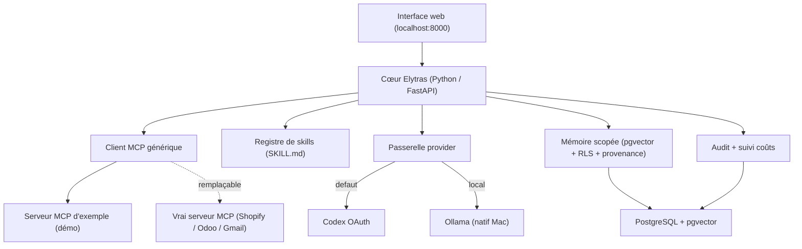
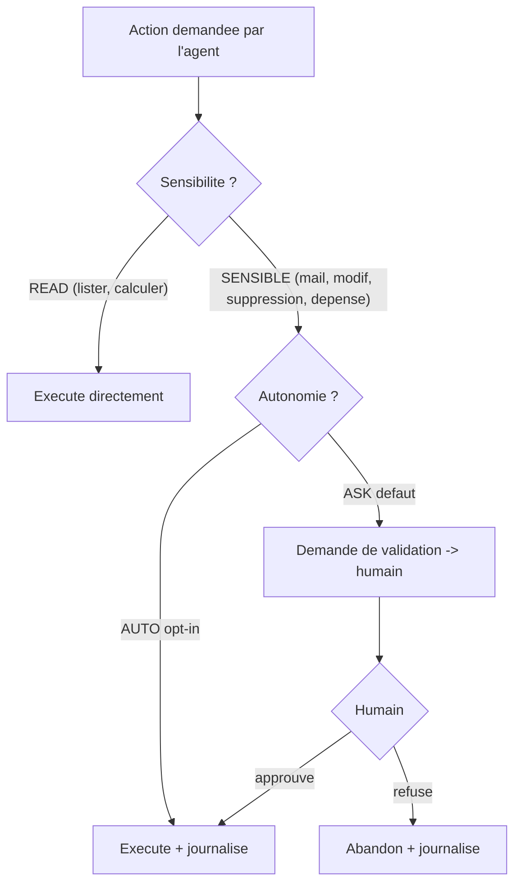

# Elytras — Phase 0 (cœur modulaire, local-first)

| | |
|---|---|
| **Version** | v2.0 — *cœur 100% modulaire (aucune intégration codée)* |
| **Date** | 30 mai 2026 |
| **Machine cible** | Mac M2, 16 Go RAM, via Docker — **léger** |
| **Objectif** | Un cœur agnostique qui parle à n'importe quel **serveur MCP**, exécute des **skills**, garde une **mémoire scopée**, et expose une **interface web** |
| **Réfère à** | `Elytras — Vision & Architecture.md` (v0.2) |

---

## 0. TL;DR

On construit le **socle générique** : **Postgres + pgvector**, un **cœur Python** (FastAPI) qui découvre des **serveurs MCP** et appelle leurs outils sans rien coder de spécifique, une **mémoire scopée anti-hallucination**, un **registre de skills**, et une **interface web** pour tout voir/tester. Pour prouver la modularité, un **serveur MCP d'exemple** (supprimable) porte une démo « clients inactifs ». Pas d'intégration en dur, pas d'Odoo, pas de Windmill.

> Correction par rapport à v1 : on a **retiré toute intégration codée** (le ShopifyConnector). Les connecteurs sont des **serveurs MCP** branchés par l'utilisateur. Le cœur ne connaît aucun système.

---

## 1. Objectif & critère de réussite

Un cœur **agnostique** : il enregistre des serveurs MCP, **liste leurs outils**, les **appelle** génériquement, applique mémoire + audit + droits, et **montre tout dans une UI**. Le critère est rempli quand, depuis l'interface, on lance les auto-tests au vert et on exécute un outil MCP de bout en bout — **en ayant pu remplacer le serveur d'exemple par un vrai connecteur sans toucher au code du cœur**.

---

## 2. Principe : zéro intégration dans le cœur

```
Cœur Elytras  ─(MCP générique)─▶  Serveur MCP  ─▶  Système réel
   (agnostique)                   (Shopify/Odoo/…)    (l'API du user)
```

- **Connecteur = serveur MCP.** Le cœur ne sait parler qu'« MCP » (`tools/list`, `tools/call`). Brancher Shopify, Odoo, Gmail = enregistrer leur serveur MCP avec les accès du user. Rien à coder côté cœur.
- **Savoir-faire = skill.** Un `SKILL.md` décrit *quoi faire* et *quels outils MCP utiliser* — c'est de la donnée, pas du code.
- **La démo « clients inactifs »** n'est PAS dans le cœur : c'est une **skill** + un **serveur MCP d'exemple** (`list_inactive_customers`). On échange le serveur, la skill marche toujours.

---

## 3. Décisions arrêtées (tes réponses intégrées)

| Sujet | Décision |
|---|---|
| **Modularité** | Aucune intégration codée. Connecteurs = **serveurs MCP** (BYO par user). Savoir-faire = **skills**. |
| **1er cas d'usage** | « Clients inactifs » — porté par une **skill** + un **MCP d'exemple**, read-only. |
| **Autonomie** | Action READ → directe ; SENSIBLE (mail, modif, suppression, dépense) → validation, sauf agent en mode `AUTO` (opt-in). |
| **Providers** | **Codex OAuth** par défaut ; **choix user** du provider/modèle ; **suivi des coûts** (`llm_usage`), pas de bascule imposée. |
| **Modèles locaux** | Ollama pour étapes simples / sensible / offline. User installe ses modèles (Gemma, MiniMax…). |
| **Runtime agent** | **LangGraph core** seul (pas de Hermes embarqué). |
| **Mémoire** | Anti-hallucination : provenance obligatoire + résumés *sans perte* (idée Lossless Claw) + scopes + RLS. |
| **Odoo** | Différé. Juste un **serveur MCP** parmi d'autres. |
| **Langage** | **Python**. Superviseur Rust = piste future. |
| **Données / RGPD** | Tout reste chez le client ; l'éditeur n'a pas accès. Seul sort ce que le user envoie à *son* provider. |

---

## 4. Périmètre Phase 0

**DANS :** Postgres+pgvector · cœur Python (FastAPI) · **client MCP générique** · **registre de serveurs MCP** · **chargeur de skills** · passerelle provider (Codex/Ollama/OpenAI) + suivi coûts · mémoire scopée + RLS + provenance · audit · politique autonomie · **interface web** · serveur MCP d'exemple (démo).

**HORS (Phase 1+) :** orchestre multi-agents, vrais connecteurs (Shopify/Odoo/Gmail via MCP), actions sensibles avec validation, mémoire projet partagée + audit des accès, Windmill/Kestra, Keycloak, Cerbos, multi-tenant.

---

## 5. Architecture Phase 0



Conteneurs : `db`, `core`, `example-mcp`, `adminer`. Ollama tourne **en natif** sur le Mac.

---

## 6. Connecteurs = serveurs MCP (BYO)

Chaque utilisateur enregistre ses serveurs MCP (table `mcp_server` : url, type d'auth, secret chiffré). Le client MCP (`tools/list`, `tools/call`) est le **seul** point de contact avec l'extérieur. Conséquence directe de ta remarque : on n'« intègre » jamais un service dans le cœur — on **branche** un serveur MCP. Odoo, Shopify, Gmail, ou un MCP maison : même mécanique, accès propres à chaque user.

**OAuth 2.1 + PKCE géré nativement.** Pour un serveur MCP protégé, l'UI lance le flow : découverte des métadonnées (RFC 9728/8414) → enregistrement dynamique du client (RFC 7591) → consentement → échange du code (PKCE) → token stocké **chiffré** et **rafraîchi** automatiquement, injecté en Bearer à chaque appel. Côté **providers d'abonnement** (Codex/Claude/Gemini), l'auth OAuth est **réimplémentée nativement** dans `elytras/provider_auth.py` — technique extraite du projet open-source **CLIProxyAPI** (sans en dépendre) : login Authorization Code + PKCE, capture du redirect sur un **port loopback** (1455/54545/8085), refresh, tokens **chiffrés**. Les deux flux (serveurs MCP et providers) sont testés de bout en bout contre des serveurs factices.

---

## 7. Skills

Un dossier + `SKILL.md` (frontmatter `name`, `description`, `mcp_tools` + instructions). C'est du savoir-faire packagé qui orchestre des outils MCP. On en ajoute en déposant un dossier (rien à coder). Exemple fourni : `skills/clients-inactifs/`.

---

## 8. Providers, modèles & coûts

- **Providers d'abonnement natifs** (Codex/Claude/Gemini) : connexion OAuth gérée par Elytras (`provider_auth.py`, technique réimplémentée de CLIProxyAPI, **aucune dépendance** à leur binaire). Login depuis l'UI, tokens chiffrés + refresh auto. **Choix user** du provider/modèle ; chaque appel logge tokens + coût (`llm_usage`).
- **Repli local** : Ollama (étapes simples, sensible, offline) ; ou clé API OpenAI.

> ⚠️ **ToS.** Réutiliser les `client_id` des CLIs officielles (Codex/Claude/Gemini) et l'endpoint interne Codex est une zone grise : à réserver à un usage **perso/self-host**, révocable sans préavis. L'**inférence** native est *best-effort* (endpoints/headers extraits de CLIProxyAPI), à valider avec un vrai compte ; l'**auth**, elle, est testée. La clé API OpenAI reste l'option garantie.

> ⚠️ **Mac.** Docker n'accède pas au GPU Metal → lance **Ollama en natif** (`brew install ollama`), le cœur lui parle via `host.docker.internal:11434`. Vise des modèles **3–4B** ; l'essentiel passe par Codex (cloud), donc empreinte locale minimale.

---

## 9. Mémoire anti-hallucination

1. **Provenance obligatoire** : un souvenir « calculé » porte sa source (`source_ref`, `provenance`) ; le recall renvoie ces sources → l'agent **cite**, n'invente pas.
2. **Sans perte (idée Lossless Claw)** : résumés hiérarchiques qui gardent le lien vers le brut (table `memory_summary`).
3. **Scopes + RLS** : global / org / projet / user / agent / session, isolés au niveau base (un agent mandaté par X ne lit pas la mémoire privée de Y, sauf projet commun).
4. **Embeddings locaux** (`nomic-embed-text` via Ollama) → la mémoire sensible ne sort pas de la machine.

---

## 10. Autonomie & validation



---

## 11. Interface web

Servie par le cœur sur **http://localhost:8000** (un seul fichier, sans build, tourne dans Docker). Elle affiche : les **auto-tests** (`/selftest`, vert/rouge), les **serveurs MCP** + leurs **outils** (avec un bouton « exécuter »), les **skills** chargées, et un **visualiseur de mémoire**. C'est ton point d'entrée pour voir l'état et tester toi-même.

---

## 12. Langage & sandbox

Python 3.12 + FastAPI. Exécution isolée dans le conteneur `core` (Phase 0) ; durcissement OS natif (Seatbelt/Landlock) et sandbox-par-agent avec les actions sensibles. Superviseur Rust = piste future.

---

## 13. Structure du repo

```
phase-0/
├── docker-compose.yml          # db + core + example-mcp + adminer
├── .env.example  Dockerfile  requirements.txt  README.md
├── db/schema.sql               # tables + pgvector + RLS ; mcp_server, skill
├── elytras/
│   ├── main.py                 # API + UI + /selftest
│   ├── mcp_client.py           # client MCP générique  ← LE connecteur
│   ├── registry.py             # serveurs MCP (BYO)
│   ├── skills.py               # chargeur SKILL.md
│   ├── providers.py            # Codex / Ollama / OpenAI + suivi coûts
│   ├── memory.py               # mémoire scopée + RLS + provenance
│   ├── policy.py               # autonomie ASK/AUTO
│   └── web/index.html          # interface
├── skills/clients-inactifs/SKILL.md     # skill d'exemple (données)
└── example-mcp/                # serveur MCP de démo (SUPPRIMABLE)
    ├── server.py  Dockerfile
```

---

## 14. Comment lancer

**Le plus simple : double-clique `phase-0/start.command`** (crée le `.env`, génère la clé de chiffrement, lance tout). Sinon :

```bash
# Ollama natif (Mac) pour embeddings + petits modèles
brew install ollama && ollama serve &
ollama pull nomic-embed-text

codex login                    # (optionnel) connecte ton compte Codex
cp .env.example .env
docker compose up --build      # db + core + example-mcp + adminer
# -> ouvre http://localhost:8000
```

---

## 15. Résultat des tests (vérifié hors Docker)

Le flux a été exercé sans Postgres (donc mémoire en attente de DB) :

```
/selftest
  [..] Base de données (Postgres + pgvector)     indisponible (pas de DB hors Docker)
  [OK] Serveur MCP d'exemple — tools/list        2 outils : list_inactive_customers, echo
  [OK] Appel d'outil MCP (list_inactive_customers) 3 clients inactifs renvoyés
  [OK] Skills chargées (SKILL.md)                clients-inactifs
UI /  -> servie (8.2 Ko)
```

Sous Docker (Postgres + Ollama up), la ligne mémoire passe au vert aussi.

---

## 16. Jalons & critères d'acceptation

| Jalon | Critère |
|---|---|
| **J1 — Infra** | `docker compose up` lance db+core+example-mcp+adminer ; `/health` OK |
| **J2 — UI** | http://localhost:8000 affiche statut + tests |
| **J3 — MCP** | l'UI liste les outils du serveur MCP et en exécute un |
| **J4 — Mémoire** | write+recall scopé OK (RLS) ; un user ne lit pas la mémoire d'un autre |
| **J5 — Modularité** | remplacer le MCP d'exemple par un autre serveur MCP sans toucher au cœur |

---

## 17. Hors Phase 0 → Phase 1

Orchestre multi-agents, vrais serveurs MCP (Shopify/Odoo/Gmail) avec accès par user, actions sensibles + validations, mémoire projet partagée + audit des accès, enregistrement de serveurs MCP/skills depuis l'UI, briefing planifié.

---

## 18. Prochaine action

Lance `docker compose up`, ouvre **localhost:8000**, regarde les tests et exécute un outil. Ensuite on branche un **vrai serveur MCP** (le tien) — c'est là que ça devient ton entreprise, sans rien recoder dans le cœur.
